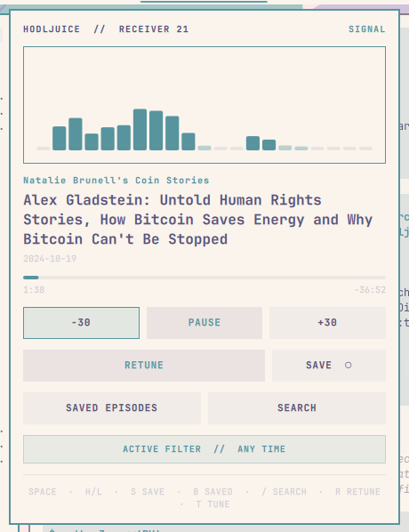

# HodlJuice for Omarchy

A theme-native Bitcoin podcast receiver for the Omarchy shell.

HodlJuice tunes into a random episode from [hodljuice.app](https://hodljuice.app), autoplays it through `mpv`, and renders a real 21-band voice signal captured from only the HodlJuice PipeWire stream.

> **Version 0.2.0.** MCP-powered discovery and search, with local playback and a live 21-band signal. See the [release notes](CHANGELOG.md).



## Features

- Random Bitcoin podcast discovery with automatic playback
- Any Time, Last 7 Days, Last 30 Days, and specific publication-year filters
- MCP-backed search by topic, guest, podcast, or phrase, with direct playback
- Retune keeps the active filter and automatically skips unavailable results
- Real per-stream 21-band spectrum—no fake animation during playback
- Podcast name and compact live signal in the Omarchy bar
- Play/pause, ±30-second seeking, progress, duration, and resume position
- Local Saved Episodes library with keyboard and pointer navigation
- Theme-native colors, type, spacing, borders, and light/dark behavior
- Local-only state with no account, analytics, advertising, or telemetry

## Controls

| Key | Action |
|---|---|
| `Space` | Play or pause |
| `H` / `L` | Seek backward or forward 30 seconds |
| `R` | Retune and autoplay using the active filter |
| `T` | Open or close the filter tuner |
| `S` | Save or unsave the current episode |
| `B` | Open Saved Episodes |
| `/` | Open search, or return to its query field |
| `J` / `K` or arrows | Move selection |
| `Enter` | Activate the selected item |
| `Esc` | Go back or close the panel |

To choose a year, press `T`, select **Specific Year**, choose the publication year, and activate **Lock Signal**. This sets the filter for both random discovery and search. The picker lists years from the current year back to 2011; coverage is thinner before 2018.

Search uses the active time filter. Press `/`, type a topic, guest, podcast, or phrase, and press `Enter` to search. Use arrows or `J` / `K` to select a result, then `Enter` to resume and play it; `Esc` returns to the receiver. In the query field, letters and spaces enter text rather than triggering playback shortcuts. Search does not interrupt the current episode until you select a result. While another episode is loading, result selection waits until loading finishes.

Pointer controls are available for every primary action. On the bar, left click opens the receiver, middle click Retunes, and right click toggles playback.

## Install

Install the published version from Git:

```bash
omarchy plugin add https://github.com/nmorton13/omarchy-hodljuice.git --enable
```

Git installs use the published default branch. To try local or unreleased changes, use the checkout installation instructions under [Development](#development).

The widget defaults to the center section. Move it at any time with:

```bash
omarchy bar move nmorton.hodljuice --section center
```

Remove it with:

```bash
~/.config/omarchy/plugins/nmorton.hodljuice/bin/hodljuice stop
omarchy plugin remove nmorton.hodljuice
```

The stop command terminates HodlJuice's detached `mpv` process before the plugin files are removed. Saved episodes and resume positions are retained under `$XDG_STATE_HOME/hodljuice/`; remove that directory separately only if you also want to delete HodlJuice's local data.

## Requirements

- Omarchy 4.0+
- Python 3.11+
- `mpv`
- PipeWire tools providing `pw-record`
- Network access to `https://hodljuice.app` and episode audio hosts

Check the runtime environment from the installed plugin directory:

```bash
./bin/hodljuice doctor
```

## Saved episodes and local data

Saving creates a local bookmark; it does not download the audio. Saved metadata is duplicate-safe by audio URL, and selecting a saved episode resumes and autoplays it. If a saved URL becomes unavailable, HodlJuice reports the failure instead of silently replacing the explicit selection.

State is stored under:

```text
$XDG_STATE_HOME/hodljuice/
```

This is normally `~/.local/state/hodljuice/` and contains saved episodes, bounded discovery history, resume positions, and current playback metadata. Private runtime files live under `$XDG_RUNTIME_DIR/hodljuice/` with user-only permissions.

## Development

Run the complete local validation suite:

```bash
./tests/run.sh
./bin/hodljuice doctor
```

Test an endpoint directly:

```bash
./bin/hodljuice discover --band all --range any --json
./bin/hodljuice discover --band all --range 7 --json
./bin/hodljuice discover --band all --range 30 --json
./bin/hodljuice discover --band all --range 2021 --json
```

Install or update from the current checkout for live Omarchy testing without copying `.git` or generated files. Back up any edits in the installed plugin first; this copies over matching files. Saved episodes and resume positions live outside the plugin directory and are retained.

```bash
plugin="$HOME/.config/omarchy/plugins/nmorton.hodljuice"
mkdir -p "$plugin"
tar --exclude=.git --exclude='__pycache__' --exclude='*.pyc' \
  -cf - . | tar -xf - -C "$plugin"

omarchy-shell shell rescanPlugins
omarchy plugin enable nmorton.hodljuice --section center
omarchy-shell shell summon nmorton.hodljuice '{}'
```

Opening the receiver starts playback automatically. If the summon command reports `unknown`, run it again once the widget appears in the bar.

After changing a mounted bar widget or panel structure, restart the shell:

```bash
omarchy restart shell
```

### CLI

The QML plugin invokes its bundled CLI directly. During development, use `./bin/hodljuice`:

```bash
./bin/hodljuice status
./bin/hodljuice watch
./bin/hodljuice current
./bin/hodljuice toggle
./bin/hodljuice seek -30
./bin/hodljuice saved
./bin/hodljuice history
./bin/hodljuice search --query "Lyn Alden" --json
./bin/hodljuice search --query "lightning privacy" --range 30 --limit 10 --json
./bin/hodljuice search --query "Taproot" --range 2021 --json
./bin/hodljuice stop
```

## Architecture and project status

The QML layer is intentionally thin. Discovery, persistence, `mpv` IPC, and spectrum analysis live in the separately testable Python CLI.

Random discovery now tries [`https://hodljuice.app/mcp`](https://hodljuice.app/mcp) first, using `random_episode` with the active time filter. This is a direct protocol client; no AI model, account, or additional Python package is required. The CLI reuses a private MCP session between retunes and reinitializes expired sessions once. If MCP is unavailable or returns unusable metadata, discovery falls back to the website with the same filter. Category, people, and specific-date routes still use the HTML adapter.

Search uses the MCP `search_episodes` tool and returns up to 25 playable results. A search failure is reported in the search view; it never substitutes a random episode. Search and discovery share the same private session.

MCP returns structured metadata and direct audio URLs, avoiding dependence on website markup. It is not necessarily faster: session initialization adds requests, while subsequent retunes use one request. Playback, saved episodes, and the visualizer are unchanged.

- [`docs/development-status.md`](docs/development-status.md) — implemented and remaining work
- [`CHANGELOG.md`](CHANGELOG.md) — version history and compatibility notes
- [`docs/implementation-plan.md`](docs/implementation-plan.md) — original product and architecture plan; development status describes what is implemented now
- [`docs/spectrum.md`](docs/spectrum.md) — real-signal design and validation

Planned follow-up work includes a recent-history panel, explicit MPRIS validation, analyzer performance measurements, and eventually deciding whether to reintroduce category and people filters.

## Privacy

HodlJuice has no accounts, analytics, advertising, or telemetry. Its MCP session ID is stored privately under `$XDG_RUNTIME_DIR/hodljuice/mcp-session.json` (or the private runtime fallback when XDG is unset); it is not an account or a saved-episode identifier. It contacts `hodljuice.app` for discovery and submitted searches, and the episode audio hosts returned by that service for playback. Search text is sent only when submitted and is not persisted locally. Remote artwork is not loaded by the current UI.

## License

[MIT](LICENSE)
